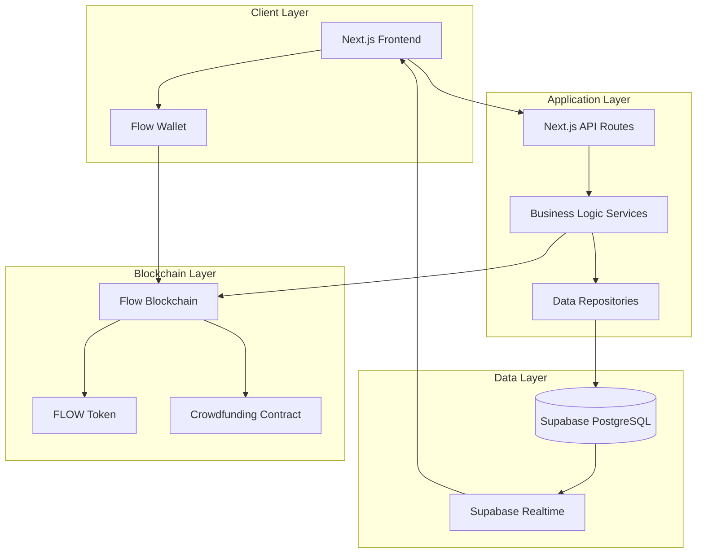
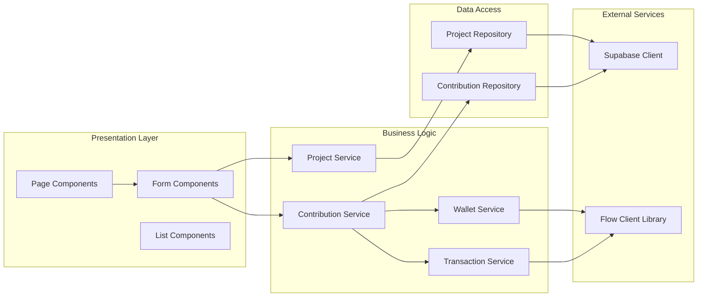
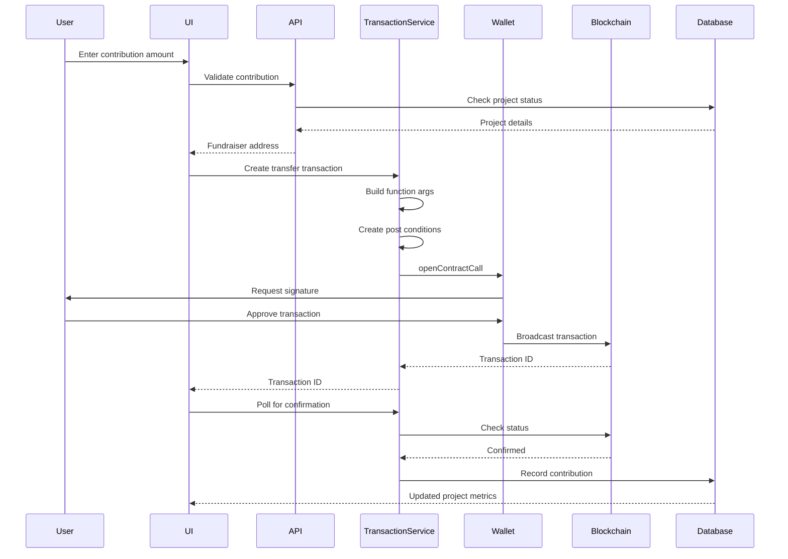
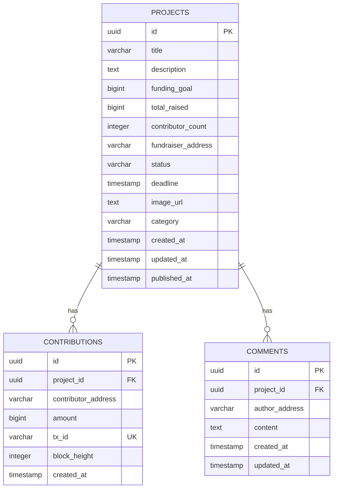
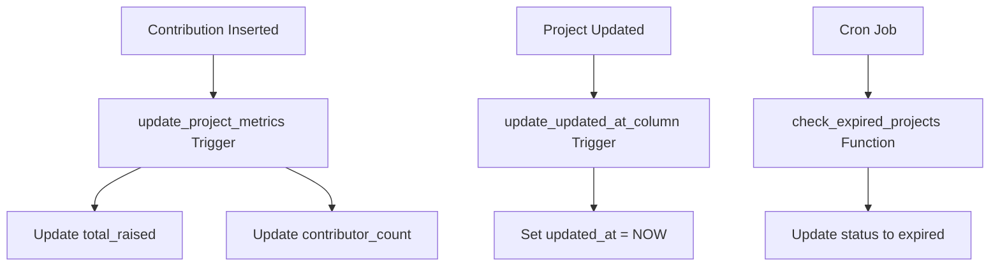
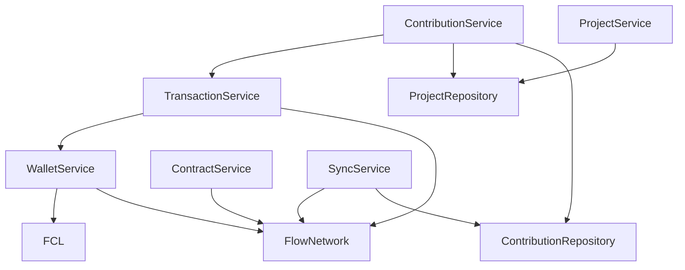
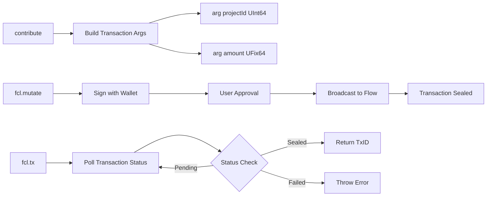
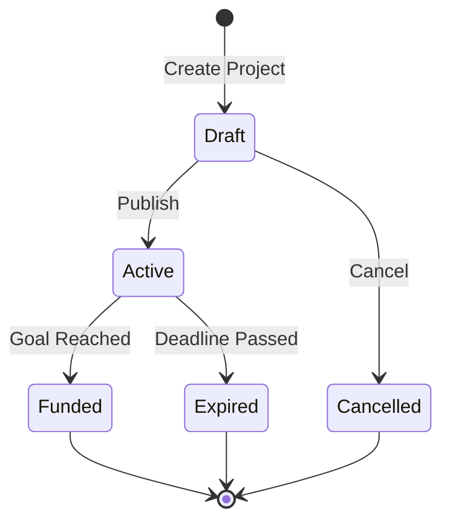
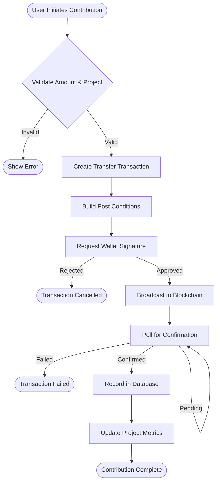

# FlowGives

A decentralized crowdfunding platform built on the Flow blockchain, enabling projects to raise capital using FLOW tokens with transparent, on-chain transactions.

## Architecture

### System Overview



### Component Architecture



## Transaction Flow

### Contribution Transaction Flow



### Post Condition Structure

Flow transactions use authorizers and payers to ensure transaction safety:

```cadence
transaction(projectId: UInt64, amount: UFix64) {
    prepare(signer: AuthAccount) {
        // Signer authorizes the transaction
        // Flow vault is accessed securely
    }
    execute {
        // Transaction logic executes
        // Contribution is recorded on-chain
    }
}
```

This structure ensures that only the authorized account can execute the transaction.

## Database Schema

### Entity Relationship Diagram



### Database Functions and Triggers



## Service Layer

### Service Dependencies



### Transaction Service Architecture



## Data Flow

### Project Lifecycle



### Contribution Processing



## Technology Stack

### Frontend
- **Framework**: Next.js 14+ (App Router)
- **Language**: TypeScript
- **Styling**: Tailwind CSS
- **State Management**: React Context API
- **Testing**: Jest, React Testing Library, fast-check

### Backend
- **Database**: Supabase (PostgreSQL)
- **API**: Next.js API Routes
- **Real-time**: Supabase Realtime Subscriptions

### Blockchain
- **Network**: Flow Blockchain (Testnet/Mainnet)
- **Token**: FLOW (Native token)
- **Wallet Integration**: @onflow/fcl (Flow Client Library)
- **Smart Contracts**: Cadence

### Development Tools
- **Package Manager**: npm
- **Type Checking**: TypeScript
- **Linting**: ESLint
- **Testing**: Jest
- **Database Migrations**: Supabase CLI

## Project Structure

```
flowgives/
├── app/                      # Next.js app directory
│   ├── api/                  # API routes
│   │   ├── projects/         # Project endpoints
│   │   ├── contributions/    # Contribution endpoints
│   │   └── sync/             # Sync endpoints
│   ├── projects/             # Project pages
│   ├── my-projects/          # User projects page
│   └── layout.tsx            # Root layout
├── lib/                      # Shared libraries
│   ├── components/           # React components
│   ├── contexts/            # React contexts
│   ├── services/            # Business logic services
│   ├── repositories/        # Data access layer
│   ├── models/              # Domain models
│   ├── utils/               # Utility functions
│   ├── config/              # FCL configuration
│   └── supabase/            # Supabase clients
├── contracts/               # Cadence smart contracts
│   ├── Crowdfunding.cdc     # Main contract
│   └── scripts/             # Query scripts
└── supabase/                # Database migrations
    └── migrations/          # SQL migration files
```

## Key Services

### TransactionService

Handles FLOW token transfer transactions with proper authorization.

**Key Methods:**
- `contribute()`: Creates and executes contribution transaction
- `withdraw()`: Allows project creators to withdraw funds
- `refund()`: Processes refunds for failed projects
- `getTransaction()`: Retrieves transaction details from Flow blockchain

**Transaction Format:**
```typescript
fcl.mutate({
  cadence: CONTRIBUTE_TRANSACTION,
  args: (arg, t) => [
    arg(projectId, t.UInt64),
    arg(amount, t.UFix64)
  ],
  limit: 9999
})
```

### ContributionService

Manages contribution lifecycle from validation to recording.

**Flow:**
1. Validate amount and project status
2. Create transfer transaction via TransactionService
3. Wait for blockchain confirmation
4. Record contribution in database
5. Update project metrics (via database trigger)

### ProjectService

Manages project lifecycle and business rules.

**Status Transitions:**
- Draft → Active (on publish)
- Active → Funded (when goal reached)
- Active → Expired (when deadline passes)
- Draft → Cancelled (manual cancellation)

### WalletService

Manages Flow wallet connections and FLOW balance queries.

**Features:**
- Multi-wallet support (Blocto, Lilico, Dapper)
- Connection state management via FCL
- Balance queries with caching
- Network switching (testnet/mainnet)

## Database Design

### Tables

**projects**
- Stores project metadata and funding metrics
- Status-driven with automatic transitions
- Indexed for performance on common queries

**contributions**
- Records on-chain contribution transactions
- Links to projects via foreign key
- Unique constraint on transaction ID

**comments**
- User comments on projects
- Linked to projects and authors
- Timestamped for ordering

### Triggers

**update_project_metrics**
- Automatically updates `total_raised` and `contributor_count`
- Fires on contribution insert
- Maintains data consistency

**update_updated_at_column**
- Updates `updated_at` timestamp on project changes
- Ensures accurate modification tracking

### Functions

**check_expired_projects()**
- Updates project status to 'expired'
- Called via cron job or manual trigger
- Checks deadline against current timestamp

## Security

### Row Level Security (RLS)

- Public projects: Readable by all users
- Draft projects: Only visible to creator
- Contributions: Public read, system-only write
- Comments: Public read, authenticated write

### Post Conditions

All FLOW transfers use Cadence's built-in authorization to prevent:
- Unexpected token transfers
- Amount discrepancies
- Unauthorized access to vaults

### Input Validation

- Database constraints (CHECK, NOT NULL)
- Application-level validation
- Type safety with TypeScript
- Transaction validation before broadcast

## Testing

### Unit Tests
- Service layer business logic
- Component rendering and interactions
- Utility function correctness

### Property-Based Tests
- WCAG AA color contrast compliance
- Smart contract invariants
- Data validation rules

### Integration Tests
- API endpoint functionality
- Database operations
- Transaction flow

## Development

### Prerequisites
- Node.js 18+
- npm or yarn
- Supabase account
- Flow wallet (Blocto, Lilico, or Dapper for testing)

### Setup

```bash
# Install dependencies
npm install

# Set up environment variables
cp .env.example .env.local
# Edit .env.local with your credentials

# Run database migrations
npm run db:push

# Start development server
npm run dev
```

### Environment Variables

```env
NEXT_PUBLIC_SUPABASE_URL=your_supabase_url
NEXT_PUBLIC_SUPABASE_ANON_KEY=your_anon_key
SUPABASE_SERVICE_ROLE_KEY=your_service_role_key
NEXT_PUBLIC_FLOW_NETWORK=testnet
NEXT_PUBLIC_FLOW_ACCESS_NODE=https://rest-testnet.onflow.org
NEXT_PUBLIC_FLOW_DISCOVERY_WALLET=https://fcl-discovery.onflow.org/testnet/authn
```

### Available Scripts

```bash
npm run dev          # Start development server
npm run build        # Build for production
npm run start        # Start production server
npm run lint         # Run ESLint
npm test             # Run tests
npm run test:watch   # Run tests in watch mode
npm run db:push      # Push database migrations
npm run db:reset     # Reset database
```

## Deployment

### Database Migrations

Migrations are managed via Supabase CLI:

```bash
# Create new migration
supabase migration new migration_name

# Apply migrations
supabase db push

# Check migration status
supabase migration list
```

### Smart Contract Deployment

```bash
# Deploy contract to testnet
flow project deploy --network=testnet

# Verify contract
flow scripts execute contracts/scripts/verify_deployment.cdc --network=testnet
```

## API Reference

### Projects

**GET /api/projects**
- List projects with optional filters
- Query params: `status`, `sortBy`, `limit`, `offset`

**GET /api/projects/[id]**
- Get project by ID

**POST /api/projects**
- Create new project (draft)

**PATCH /api/projects/[id]**
- Update draft project

**POST /api/projects/[id]/publish**
- Publish project (draft → active)

### Contributions

**POST /api/projects/[id]/contribute**
- Validate contribution and return fundraiser address
- Body: `{ amount: string, contributorAddress: string }`

**POST /api/contributions**
- Record confirmed contribution
- Body: `{ projectId, contributorAddress, amount, txId, blockHeight }`

**GET /api/projects/[id]/contributions**
- List contributions for a project

## References

- [Flow Documentation](https://developers.flow.com/)
- [Cadence Language Reference](https://cadence-lang.org/)
- [FCL (Flow Client Library)](https://developers.flow.com/tools/clients/fcl-js)
- [Supabase Documentation](https://supabase.com/docs)
- [Next.js Documentation](https://nextjs.org/docs)
