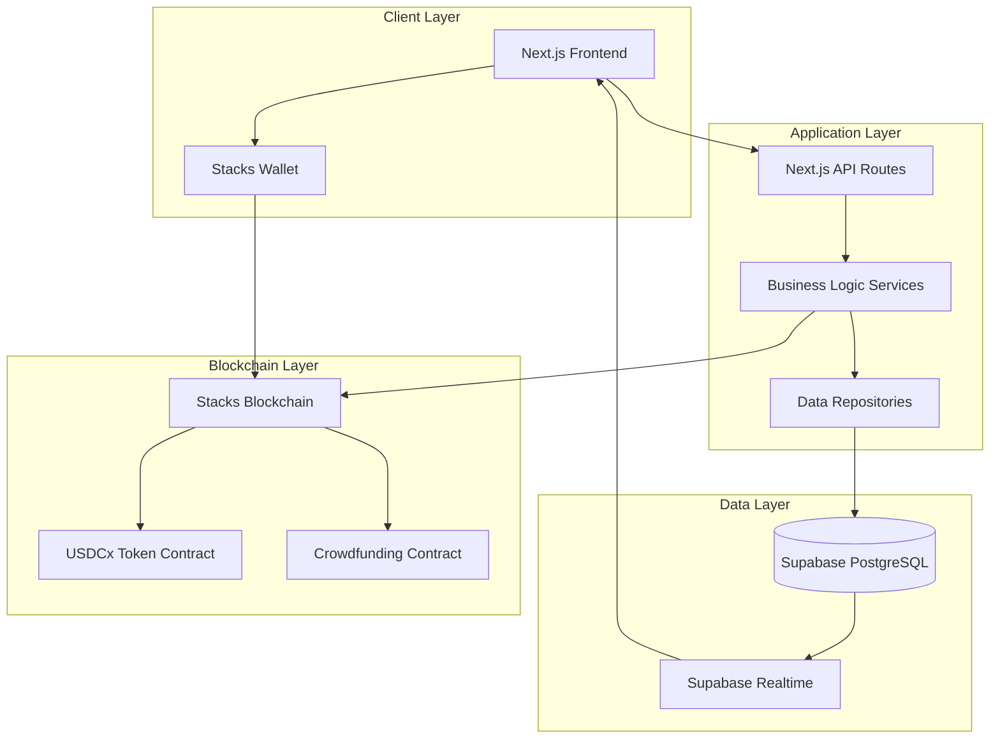
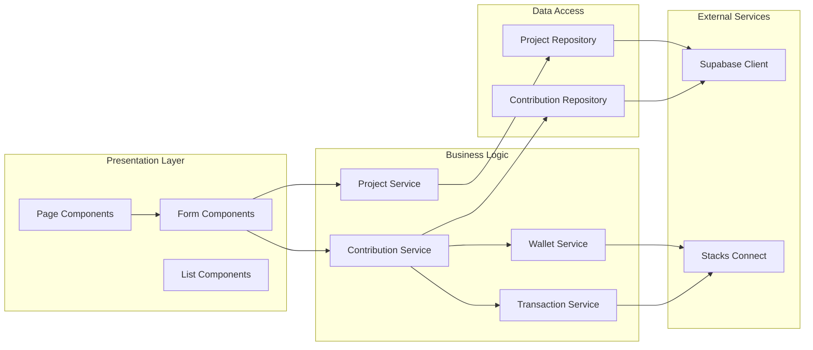
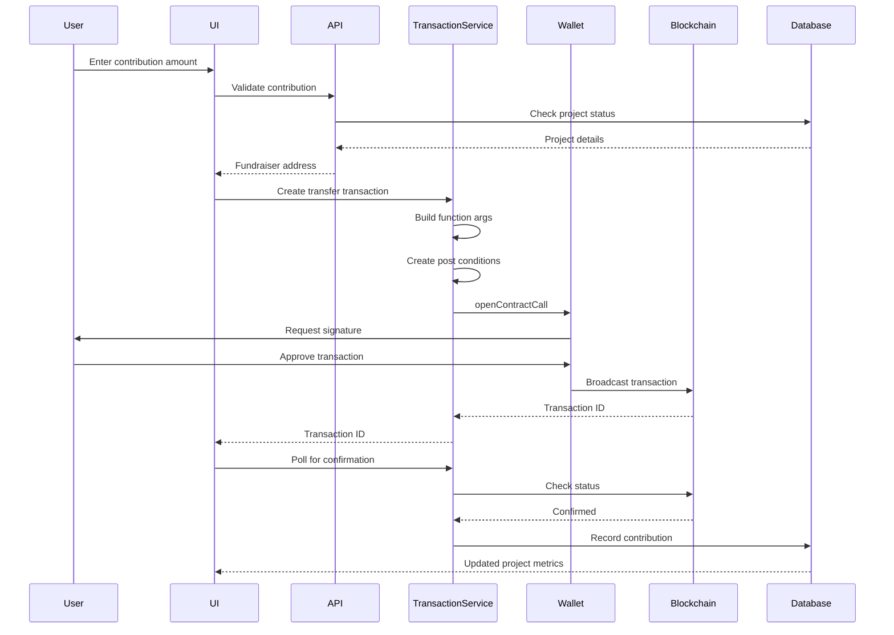
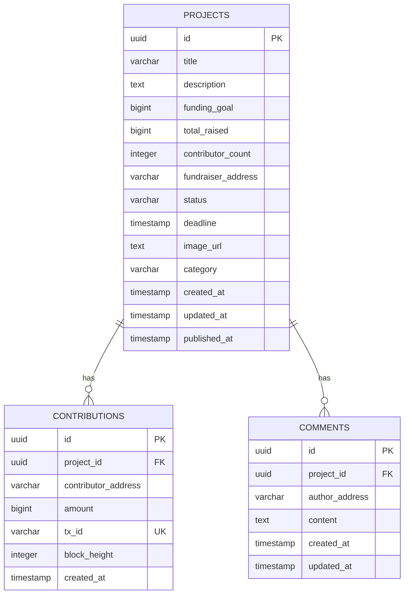
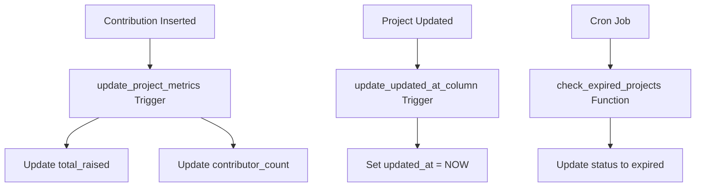
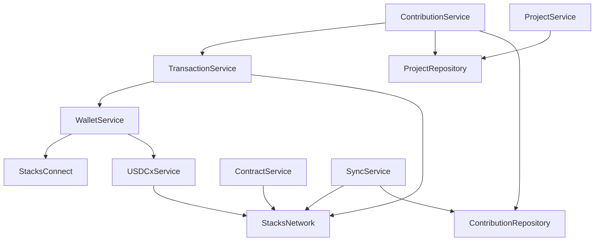
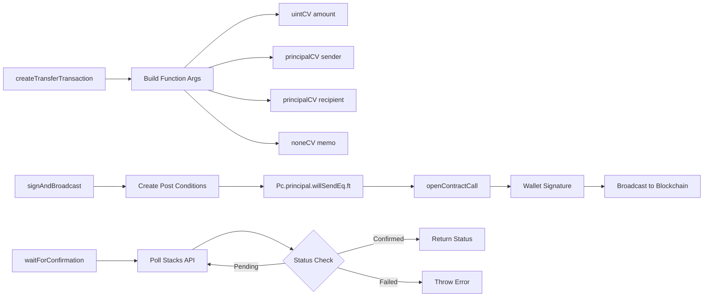
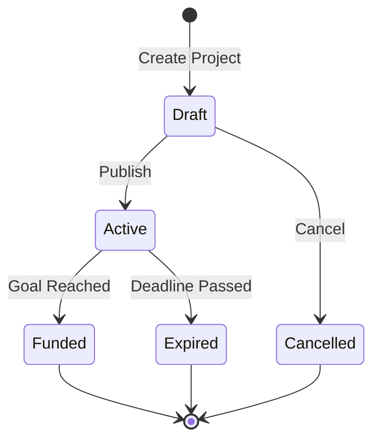

# StacksGives

A decentralized crowdfunding platform built on the Stacks blockchain, enabling projects to raise capital using USDCx tokens with transparent, on-chain transactions.

## Architecture

### System Overview



### Component Architecture



## Transaction Flow

### Contribution Transaction Flow



### Post Condition Structure

Post conditions ensure transaction safety by specifying expected outcomes:

```typescript
Pc.principal(senderAddress)
  .willSendEq(amount.toString())
  .ft(usdcxContract, 'usdcx-token')
```

This post condition verifies that the sender transfers exactly the specified amount of USDCx tokens, or the transaction aborts.

## Database Schema

### Entity Relationship Diagram



### Database Functions and Triggers



## Service Layer

### Service Dependencies



### Transaction Service Architecture



## Data Flow

### Project Lifecycle



### Contribution Processing


## Technology Stack

### Frontend
- **Framework**: Next.js 14+ (App Router)
- **Language**: TypeScript
- **Styling**: Tailwind CSS
- **State Management**: React Context API
- **Testing**: Jest, React Testing Library, fast-check

### Backend
- **Database**: Supabase (PostgreSQL)
- **API**: Next.js API Routes
- **Real-time**: Supabase Realtime Subscriptions

### Blockchain
- **Network**: Stacks Blockchain (Testnet/Mainnet)
- **Token**: USDCx (SIP-010 fungible token)
- **Wallet Integration**: @stacks/connect
- **Smart Contracts**: Clarity

### Development Tools
- **Package Manager**: npm
- **Type Checking**: TypeScript
- **Linting**: ESLint
- **Testing**: Jest
- **Database Migrations**: Supabase CLI

## Project Structure

```
stacks-gives/
├── app/                      # Next.js app directory
│   ├── api/                  # API routes
│   │   ├── projects/         # Project endpoints
│   │   ├── contributions/    # Contribution endpoints
│   │   └── sync/             # Sync endpoints
│   ├── projects/             # Project pages
│   ├── my-projects/          # User projects page
│   └── layout.tsx            # Root layout
├── lib/                      # Shared libraries
│   ├── components/           # React components
│   ├── contexts/            # React contexts
│   ├── services/            # Business logic services
│   ├── repositories/        # Data access layer
│   ├── models/              # Domain models
│   ├── utils/               # Utility functions
│   └── supabase/            # Supabase clients
├── contracts/               # Clarity smart contracts
│   ├── crowdfunding.clar    # Main contract
│   └── crowdfunding.test.ts # Contract tests
├── supabase/                # Database migrations
│   └── migrations/          # SQL migration files
└── scripts/                 # Utility scripts
```

## Key Services

### TransactionService

Handles USDCx transfer transactions with post conditions for safety.

**Key Methods:**
- `createTransferTransaction()`: Constructs unsigned transaction
- `signAndBroadcast()`: Opens wallet for signing and broadcasts
- `waitForConfirmation()`: Polls for transaction confirmation
- `getTransaction()`: Retrieves transaction details

**Post Condition Format:**
```typescript
Pc.principal(senderAddress)
  .willSendEq(amount.toString())
  .ft(usdcxContract, 'usdcx-token')
```

### ContributionService

Manages contribution lifecycle from validation to recording.

**Flow:**
1. Validate amount and project status
2. Create transfer transaction via TransactionService
3. Wait for blockchain confirmation
4. Record contribution in database
5. Update project metrics (via database trigger)

### ProjectService

Manages project lifecycle and business rules.

**Status Transitions:**
- Draft → Active (on publish)
- Active → Funded (when goal reached)
- Active → Expired (when deadline passes)
- Draft → Cancelled (manual cancellation)

### WalletService

Manages Stacks wallet connections and USDCx balance queries.

**Features:**
- Multi-wallet support (Hiro, Xverse)
- Connection state management
- Balance queries with caching
- Network switching (testnet/mainnet)

## Database Design

### Tables

**projects**
- Stores project metadata and funding metrics
- Status-driven with automatic transitions
- Indexed for performance on common queries

**contributions**
- Records on-chain contribution transactions
- Links to projects via foreign key
- Unique constraint on transaction ID

**comments**
- User comments on projects
- Linked to projects and authors
- Timestamped for ordering

### Triggers

**update_project_metrics**
- Automatically updates `total_raised` and `contributor_count`
- Fires on contribution insert
- Maintains data consistency

**update_updated_at_column**
- Updates `updated_at` timestamp on project changes
- Ensures accurate modification tracking

### Functions

**check_expired_projects()**
- Updates project status to 'expired'
- Called via cron job or manual trigger
- Checks deadline against current timestamp

## Security

### Row Level Security (RLS)

- Public projects: Readable by all users
- Draft projects: Only visible to creator
- Contributions: Public read, system-only write
- Comments: Public read, authenticated write

### Post Conditions

All USDCx transfers include post conditions to prevent:
- Unexpected token transfers
- Amount discrepancies
- Unauthorized transfers

### Input Validation

- Database constraints (CHECK, NOT NULL)
- Application-level validation
- Type safety with TypeScript
- Transaction validation before broadcast

## Testing

### Unit Tests
- Service layer business logic
- Component rendering and interactions
- Utility function correctness

### Property-Based Tests
- WCAG AA color contrast compliance
- Smart contract invariants
- Data validation rules

### Integration Tests
- API endpoint functionality
- Database operations
- Transaction flow

## Development

### Prerequisites
- Node.js 18+
- npm or yarn
- Supabase account
- Stacks wallet (for testing)

### Setup

```bash
# Install dependencies
npm install

# Set up environment variables
cp .env.example .env.local
# Edit .env.local with your credentials

# Run database migrations
npm run db:push

# Start development server
npm run dev
```

### Environment Variables

```env
NEXT_PUBLIC_SUPABASE_URL=your_supabase_url
NEXT_PUBLIC_SUPABASE_ANON_KEY=your_anon_key
SUPABASE_SERVICE_ROLE_KEY=your_service_role_key
NEXT_PUBLIC_STACKS_NETWORK=testnet
```

### Available Scripts

```bash
npm run dev          # Start development server
npm run build        # Build for production
npm run start        # Start production server
npm run lint         # Run ESLint
npm test             # Run tests
npm run test:watch   # Run tests in watch mode
npm run db:push      # Push database migrations
npm run db:reset     # Reset database
```

## Deployment

### Database Migrations

Migrations are managed via Supabase CLI:

```bash
# Create new migration
supabase migration new migration_name

# Apply migrations
supabase db push

# Check migration status
supabase migration list
```

### Smart Contract Deployment

```bash
# Deploy contract to testnet
npm run deploy:contract

# Verify contract
npm run deploy:contract:check
```

## API Reference

### Projects

**GET /api/projects**
- List projects with optional filters
- Query params: `status`, `sortBy`, `limit`, `offset`

**GET /api/projects/[id]**
- Get project by ID

**POST /api/projects**
- Create new project (draft)

**PATCH /api/projects/[id]**
- Update draft project

**POST /api/projects/[id]/publish**
- Publish project (draft → active)

### Contributions

**POST /api/projects/[id]/contribute**
- Validate contribution and return fundraiser address
- Body: `{ amount: string, contributorAddress: string }`

**POST /api/contributions**
- Record confirmed contribution
- Body: `{ projectId, contributorAddress, amount, txId, blockHeight }`

**GET /api/projects/[id]/contributions**
- List contributions for a project

## References

- [Stacks Documentation](https://docs.stacks.co/)
- [Supabase Documentation](https://supabase.com/docs)
- [Next.js Documentation](https://nextjs.org/docs)
- [Clarity Language Reference](https://docs.stacks.co/clarity)
